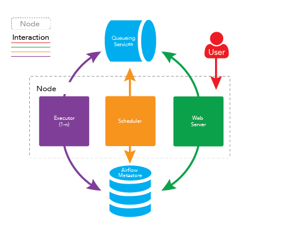

# apache-airflow

## airflow的守护进程

airflow系统在运行时有许多守护进程，它们提供了airflow的全部功能。守护进程包括WEB服务器：webserver、调度程序：scheduler、执行单元：worker、消息队列监控工具：Flower等。


### webserver

webserver是一个守护进程，它接受HTTP请求、允许通过其它WEB应用程序与airflow进行交互，webserver提供以下功能：

- 中止、恢复、触发任务  
- 监控正在运行的任务，断电续跑任务
- 执行ad-hoc命令或SQL语句来查询任务的状态，日志等详细信息
- 配置连接，包括不限于数据库、ssh的连接等

webserver守护进程使用gunicorn服务器处理并发请求，可通过修改{AIRFLOW_HOME}/airflow.cfg文件中workers的值来控制处理并发请求的进程数。
例如：

```python
workers = 4 # 表示开启4个gunicoen worker处理web请求
```

启动webserver守护进程：
```shell
airflow webserver -D
```

### scheduler

scheduler是一个守护进程，它周期性轮询任务的调度计划，以确定是否触发任务执行。

启动scheduler守护进程：

```shell
airflow scheduler -D
```

### worker

worker是一个守护进程，它启动一个或多个celery任务队列，负责执行具体的DAG任务。

当设置airflow的executors设置为CeleryExecutor时才需要开启worker守护进程。

启动worker守护进程，默认的队列名为default：

```shell
airflow worker -D
```

### flower

flower是一个守护进程，可用于通过web页面监控celery消息队列。

启动flower守护进程：

```shell
airflow flower -D
```

默认的端口为5555，可以在浏览器通过地址<http://localhost:5555>来访问flower，对celery消息队列进行监控。

## airflow的守护进程是如何一起工作的

需要注意的是airflow的守护进程彼此之间是独立的，他们并不相互依赖，也不相互感知。每个守护进程在运行时只处理分配到自己身上的任务，他们在一起运行时，提供了airflow的全部功能。

1.调度器scheduler会间隔性地轮询元数据库（Metastore）已注册的DAG是否需要被执行。如果一个具体的DAG根据其调度计划需要被执行，scheduler守护进程就会先在元数据库创建一个DagRun实例，并触发DAG内部的具体task，触发其实并不是真正的去执行，而是推送task消息至消息队列中（Broker）中，每一个task消息都包含task的DAG ID，task ID，及具体需要被执行的函数。如果task是要执行bash脚本，那么task消息还会包含bash脚本的代码。

2.用户可以在webserver上来控制DAG，比如手动触发一个DAG去执行。当用户这样做的时候，一个DagRun的实例将在元数据库被创建，scheduler去触发DAG中具体的task。

3.worker守护进程将会监听消息队列，如果有消息就从消息队列中取出消息，当取出任务消息时，它会更新元数据库中的DagRun实例的状态为正在运行，并尝试执行DAG中的task，如果DAG执行成功，则更新DagRun实例的状态为成功，否则更新状态为失败。

## airflow单节点部署

将以上所有守护进程运行在同一台机器上即可完成airflow的单节点部署，架构如下图所示



